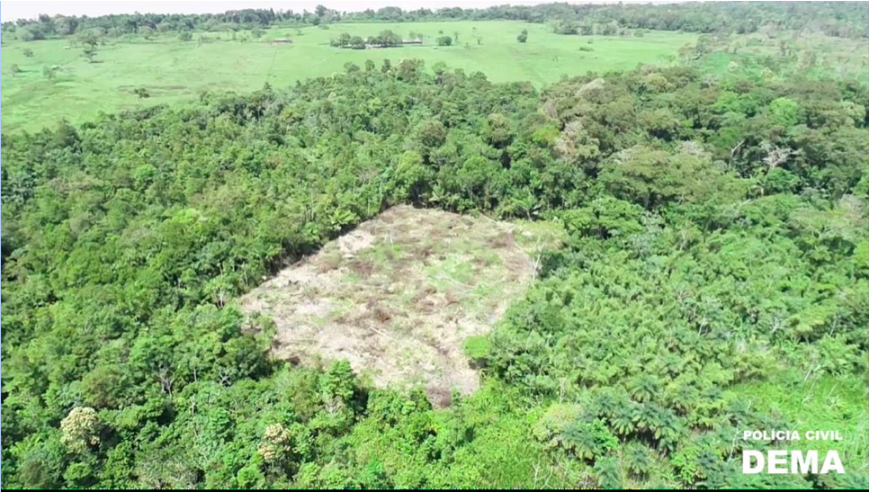
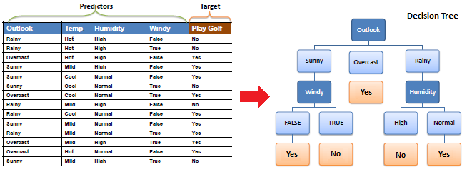
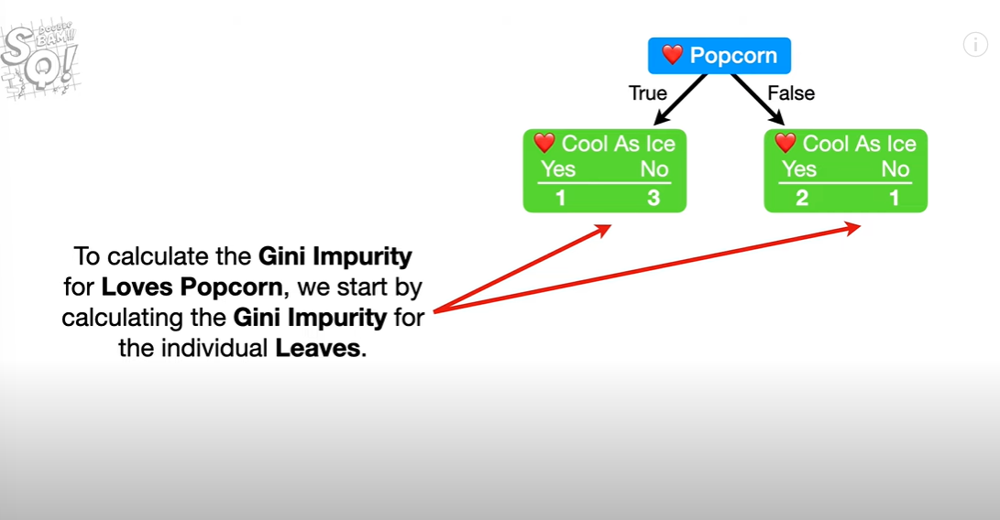
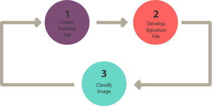
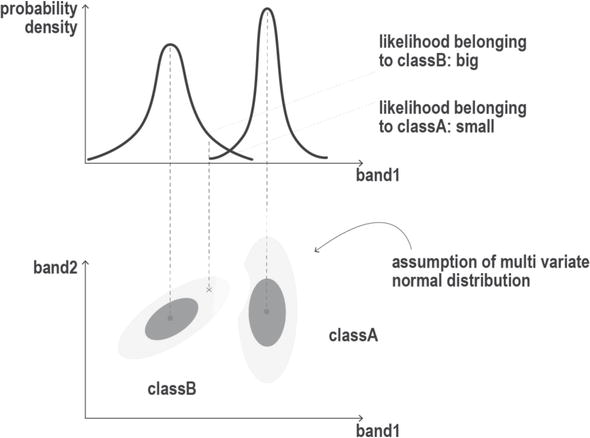
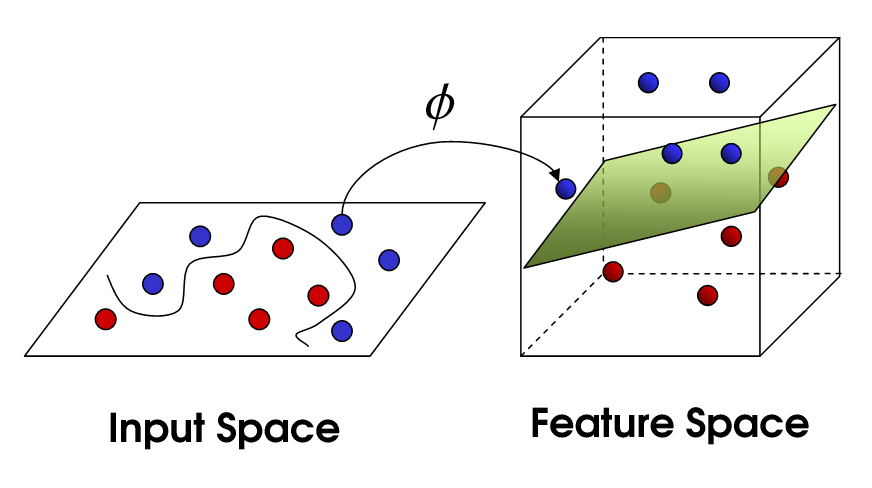
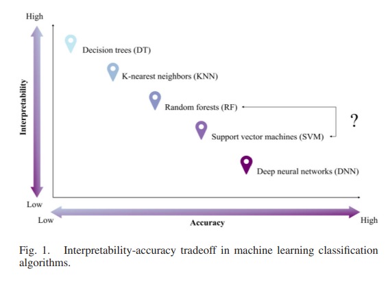

```{r setup, include=FALSE}
options(htmltools.dir.version = FALSE)
```

```{r xaringan-all, echo=FALSE}
library(countdown)
library(xaringan)
library(xaringanExtra)
library(knitr)

hook_source <- knitr::knit_hooks$get('source')
knitr::knit_hooks$set(source = function(x, options) {
  x <- stringr::str_replace(x, "^[[:blank:]]?([^*].+?)[[:blank:]]*#<<[[:blank:]]*$", "*\\1")
  hook_source(x, options)
})

xaringanExtra::use_broadcast()
xaringanExtra::use_freezeframe()
xaringanExtra::use_scribble()
#xaringanExtra::use_slide_tone()
xaringanExtra::use_search(show_icon = TRUE, auto_search	=FALSE)
xaringanExtra::use_freezeframe()
xaringanExtra::use_clipboard()
xaringanExtra::use_tile_view()
xaringanExtra::use_panelset()
xaringanExtra::use_editable(expires = 1)
xaringanExtra::use_fit_screen()
xaringanExtra::use_extra_styles(
  hover_code_line = TRUE,         
  mute_unhighlighted_code = TRUE  
)

```

class: center, title-slide, middle

background-image: url("img/CASA_Logo_no_text_trans_17.png")
background-size: cover
background-position: center


<style>
.title-slide .remark-slide-number {
  display: none;
}
</style>

```{r load_packages, message=FALSE, warning=FALSE, include=FALSE}
library(fontawesome)
```

# Remotely Sensing Cities and Environments

### Lecture 6: Classification

### 02/02/2022 (updated: `r format(Sys.time(), "%d/%m/%Y")`)

`r fa("paper-plane", fill = "#562457")` [a.maclachlan@ucl.ac.uk](mailto:a.maclachlan@ucl.ac.uk)
`r fa("twitter", fill = "#562457")` [andymaclachlan](https://twitter.com/andymaclachlan)
`r fa("github", fill = "#562457")` [andrewmaclachlan](https://github.com/andrewmaclachlan)
`r fa("location-dot", fill = "#562457")` [Centre for Advanced Spatial Analysis, UCL](https://www.ucl.ac.uk/bartlett/casa/)
`r fa("file-pdf", fill = "#562457")` [PDF presentation](https://github.com/andrewmaclachlan/CASA0023-lecture-6/blob/main/index.pdf)


<a href="https://github.com/andrewmaclachlan" class="github-corner" aria-label="View source on GitHub"><svg width="80" height="80" viewBox="0 0 250 250" style="fill:#fff; color:#151513; position: absolute; top: 0; border: 0; left: 0; transform: scale(-1, 1);" aria-hidden="true"><path d="M0,0 L115,115 L130,115 L142,142 L250,250 L250,0 Z"></path><path d="M128.3,109.0 C113.8,99.7 119.0,89.6 119.0,89.6 C122.0,82.7 120.5,78.6 120.5,78.6 C119.2,72.0 123.4,76.3 123.4,76.3 C127.3,80.9 125.5,87.3 125.5,87.3 C122.9,97.6 130.6,101.9 134.4,103.2" fill="currentColor" style="transform-origin: 130px 106px;" class="octo-arm"></path><path d="M115.0,115.0 C114.9,115.1 118.7,116.5 119.8,115.4 L133.7,101.6 C136.9,99.2 139.9,98.4 142.2,98.6 C133.8,88.0 127.5,74.4 143.8,58.0 C148.5,53.4 154.0,51.2 159.7,51.0 C160.3,49.4 163.2,43.6 171.4,40.1 C171.4,40.1 176.1,42.5 178.8,56.2 C183.1,58.6 187.2,61.8 190.9,65.4 C194.5,69.0 197.7,73.2 200.1,77.6 C213.8,80.2 216.3,84.9 216.3,84.9 C212.7,93.1 206.9,96.0 205.4,96.6 C205.1,102.4 203.0,107.8 198.3,112.5 C181.9,128.9 168.3,122.5 157.7,114.1 C157.9,116.9 156.7,120.9 152.7,124.9 L141.0,136.5 C139.8,137.7 141.6,141.9 141.8,141.8 Z" fill="currentColor" class="octo-body"></path></svg></a><style>.github-corner:hover .octo-arm{animation:octocat-wave 560ms ease-in-out}@keyframes octocat-wave{0%,100%{transform:rotate(0)}20%,60%{transform:rotate(-25deg)}40%,80%{transform:rotate(10deg)}}@media (max-width:500px){.github-corner:hover .octo-arm{animation:none}.github-corner .octo-arm{animation:octocat-wave 560ms ease-in-out}}</style>

---

```{r, echo=FALSE}
xaringanExtra::use_progress_bar(color = "#0051BA", location = "bottom")
```

# How to use the lectures


- Slides are made with [xaringan](https://slides.yihui.org/xaringan/#1)

- `r fa("magnifying-glass")` In the bottom left there is a search tool which will search all content of presentation

- Control + F will also search 

- Press enter to move to the next result 

- `r fa("pencil")` In the top right let's you draw on the slides, although these aren't saved.

- Pressing the letter `o` (for overview) will allow you to see an overview of the whole presentation and go to a slide

- Alternatively just typing the slide number e.g. 10 on the website will take you to that slide

- Pressing alt+F will fit the slide to the screen, this is useful if you have resized the window and have another open - side by side. 

```{r xaringan-logo, echo=FALSE}
xaringanExtra::use_logo(
  image_url = "img/casa_logo.jpg",
  width = "50px",
  position = xaringanExtra::css_position(top = "1em", right = "2em")

)
```
---
# Lecture outline

.pull-left[

### Part 1: Review of how classified data is used


### Part 2: How to classify remotely sensed data

]

.pull-right[
```{r echo=FALSE, out.width='100%'}
knitr::include_graphics('img/satellite.png')
```
.small[Source:[Original from the British Library. Digitally enhanced by rawpixel.](https://www.rawpixel.com/image/571789/solar-generator-vintage-style)
]]

---
class: inverse, center, middle

# Let's look back at last week and see how some studies used classfied data


---
# Urban expansion 

**Sensor**

* Landsat

```{r echo=FALSE, out.width='35%', fig.align='center'}
knitr::include_graphics('img/urban_area.png')
```
.small[Figure 2. Urban expansion within the Perth Metropolitan Region (PMR) between 1990 and 2015. Vast urban growth has been observed in PMR with graduating colours exhibiting outward expansion (a); (b) and (c) exhibit static snapshots of urban extent from 2000 (b) and 2015 (c); whilst (d) depicts percentage of urban change per subnational administrative boundary (Local Government Area; LGA).Source:[MacLachlan et al. 2017](https://www.mdpi.com/2073-445X/6/1/9)
]

---

# Air pollution and LULC

**Sensors**

* Sentinel-3 Sea and Land Surface Temperature
* Sentinel-5 Precursor Major Air Pollutants

Question: LULC transformation on air pollution, increase MAP (Major Air Pollutants) and LST 

* Used regression...

* Honeycombing - hex grids for different sensor data

```{r echo=FALSE, out.width='60%', fig.align='center'}
knitr::include_graphics('img/LST_honeycombing.jpg')
```
.small[Fig. 2. The classified honeycomb dataset for LST, PM₂.₅, SO₂, NO₂, CO, and O₃..Source:[Fuldalu and Alta, 2021](https://www.sciencedirect.com/science/article/pii/S2212095521001887?casa_token=0kyJ1dZmkm0AAAAA:syu0WnpPpsCKiY6PiBfzkf2epGa5uldthCpOt1Hey9_pmOF_uel1WpuYECTvF0jr3uzcRCrbd5k#f0005)
]

---
# Air pollution and LULC 2


> There is no doubt that the LULC distribution significantly affects the MAP and LST. Therefore, to determine this relationship **the latest LULC distribution shape-file was acquired from the National Cartographic Center of Iran (NCC)**

--

> To figure out the impact of LULC on the LST and MAP (Major Air Pollutants) the following statistical comparison perform [summary stats - mean, min etc)], the LULC was chosen as an independent variable whereas LST, PM₂.₅, SO₂, NO₂, CO, and O₃ are considered as dependent variables


Although this wasn't used in regression...that was just for the scatter plots of the variables...

But we have classified data (or we might) from a national center 
  * although no data is given
  * no accuracy or method provided

---
# Air pollution and LULC 3


```{r echo=FALSE, out.width='100%', fig.align='center'}
  knitr::include_graphics('img/summary_stats_fuldalu_21.jpg')
```
.small[Fig. 3. Box-and-whisker plots between the LULC and the LST, PM₂.₅, SO₂, NO₂, CO, O₃. Source:[Fuldalu and Alta, 2021](https://www.sciencedirect.com/science/article/pii/S2212095521001887?casa_token=0kyJ1dZmkm0AAAAA:syu0WnpPpsCKiY6PiBfzkf2epGa5uldthCpOt1Hey9_pmOF_uel1WpuYECTvF0jr3uzcRCrbd5k#f0005)
]

---

# Air pollution and LULC 4

```{r echo=FALSE, out.width='100%', fig.align='center'}
  
```
.small[Fig. 4. The Scatter-plot among the DEM, LST, PM₂.₅, SO₂, NO₂, CO, and O₃. Source:[Fuldalu and Alta, 2021](https://www.sciencedirect.com/science/article/pii/S2212095521001887?casa_token=0kyJ1dZmkm0AAAAA:syu0WnpPpsCKiY6PiBfzkf2epGa5uldthCpOt1Hey9_pmOF_uel1WpuYECTvF0jr3uzcRCrbd5k#f0005)
]


---


# Urban green spaces

> Our results show that the techniques are hybrid methods (37 cases), followed by object-based image analysis (29 cases), land cover indices (20 cases) and fraction methods (16 cases) 

.pull-left[
**acronyms** 

Inventory and assessment (Inv_Ass);Biomass and carbon (BC);Change detection (CD); Ecosystem services (ES):Overall UGSs mapping (OUGS);Species mapping (Spe);Three-dimensional modeling (TDM).

Google refers to Google Earth products; High spatial resolution (Hig); High spatial resolution & Medium spatial resolution (Hig_Med); Hyperspectral (Hyp); LiDAR(Li); LiDAR & High spatialresolution (Li_Hig); LiDAR & Hyperspectral (Li_Hyp); Medium spatial resolution(Med).


]

.pull-right[
```{r echo=FALSE, out.width='150%', fig.align='center'}

```
.small[Fig. 4. Different techniques to characterize UGSs: (a) frequency of use of techniques according to type of remotely-sensed data, and (b) frequency of use of techniques according to application area. Source:[Shahtahmassebi et al. 2021](https://www.sciencedirect.com/science/article/pii/S1618866720307639?casa_token=ZrACATZktIAAAAAA:9bCBg0pBWBsIPmYMufywYK54cyPXoImsgNxQCN_JBR2zUQ50mvnKHcKZ9CnB2ywCNNsOCw-tpBU#!)]
]
 

---

# Urban green spaces 2

Different sensors used for different mapping purposes, but can be mixed and matched (used intechangably)

```{r echo=FALSE, out.width='75%', fig.align='center'}

```
.small[Fig. 5. Different techniques to characterize UGSs: (a) frequency of use of techniques according to type of remotely-sensed data, and (b) frequency of use of techniques according to application area. Source:[Shahtahmassebi et al. 2021](https://www.sciencedirect.com/science/article/pii/S1618866720307639?casa_token=ZrACATZktIAAAAAA:9bCBg0pBWBsIPmYMufywYK54cyPXoImsgNxQCN_JBR2zUQ50mvnKHcKZ9CnB2ywCNNsOCw-tpBU#!)]


---

# Monitoring forests + illegal logging 

.pull-left[
* Leonardo Brito became chief of police at the Police Specialized in Crimes Against the Environment (DEMA) in Brazil’s Amapá stated, he noticed that the department hardly ever investigated environmental crimes

* 2 employees, two vehicles, a boat and a drone, which collects only 20 minutes of footage at a time, to patrol an area of forest the size of Nepal.

* PRODES and DETER = annual data or 250m resolution

* Used [Global Forest Watch produced by Hansen et al. in GEE](https://developers.google.com/earth-engine/tutorials/tutorial_forest_01)

]


.pull-right[
```{r echo=FALSE, out.width='75%', fig.align='center'}

```
.small[[Environmental chief police Leonardo Brito and his team examine a deforested area. Image courtesy of DEMA-AP](https://news.mongabay.com/2019/04/how-a-sheriff-in-brazil-is-using-satellites-to-stop-deforestation/)]


]

---

# Monitoring forests + illegal logging 

* Uses the app version - Forest Watcher

> Brito said that since they starting using the app, Amapá’s environmental police have been able to detect 5,000 areas of deforestation in the state, both legal and illegal. He adds that every day he sees new locations to add to the ever-growing list.

**Trying to clear small patches to avoid detection!**

```{r echo=FALSE, out.width='60%', fig.align='center'}

```
.small[[Image courtesy of DEMA-AP.](https://news.mongabay.com/2019/04/how-a-sheriff-in-brazil-is-using-satellites-to-stop-deforestation/)]


---

# Monitoring forests + illegal logging 

[Hansen, M.C., Potapov, P.V., Moore, R., Hancher, M., Turubanova, S.A., Tyukavina, A., Thau, D., Stehman, S.V., Goetz, S.J., Loveland, T.R., Kommareddy, A., Egorov, A., Chini, L., Justice, C.O., Townshend, J.R.G., 2013. High-Resolution Global Maps of 21st-Century Forest Cover Change. Science 342, 850–853.]( https://doi.org/10.1126/science.1244693)


**Sensor**

* Landsat (2000 to 2012)

Monitoring forest loss and illegal logging 

* Pre-processing

> "Landsat pre-processing steps included: (i) image resampling, (ii) conversion of raw
digital values (DN) to top of atmosphere (TOA) reflectance, (iii) cloud/shadow/water
screening and quality assessment (QA), and (iv) image normalization"

> The stack of QA layers was used to create a perpixel set of cloud-free image observations which in turn was employed to calculate timeseries spectral metrics.

---

# Monitoring forests + illegal logging 

* Creating metrics

> Metrics represent a generic feature space that facilitates regionalscale mapping and have been used extensively with MODIS and AVHRR data

> (i) reflectance values representing maximum, minimum and selected percentile values 
  (ii) mean reflectance values for observations between selected percentiles
  (iii) slope of linear regression of band reflectance value versus
image date.

In support of this reference is given to [Hansen et al. 2010](https://www.pnas.org/doi/epdf/10.1073/pnas.0912668107)...supplementary material...

> The time-sequential MODIS 32-dayinputs were transformed to annual metrics to produce a more generalized feature space

---

# Monitoring forests + illegal logging 


> "a more generalized feature space"

* Feature space = scattergram of two bands (or things that have been made into bands)

* Can be used for very basic classification - selecting the values that represent land cover

.pull-left[
```{r echo=FALSE, out.width='100%', fig.align='center'}

```
.small[Feature space. Source:[Wikimedia commons 2022](https://commons.wikimedia.org/wiki/File:Multi_Hyper-spectral_Image_feature_space.svg)
]
]

.pull-right[
```{r echo=FALSE, out.width='80%', fig.align='center'}
knitr::include_graphics('img/Spectral-curves-scatter-plot.png')
```
.small[Spectral curves on the scatter plot. Source:[50northspatial](http://www.50northspatial.org/n-dimensional-spectral-feature-space-envi/)
]
]
---
# Monitoring forests + illegal logging 

* Training data (in supervised machine learning)

> Training data to relate to the Landsat metrics were derived from image interpretation methods, including mapping of crown/no crown categories using very high spatial resolution data such as Quickbird imagery, existing percent tree cover layers derived from Landsat data (29), and global MODIS percent tree cover (30), rescaled using the higher spatial resolution percent tree cover data sets

```{r echo=FALSE, out.width='80%', fig.align='center'}
knitr::include_graphics('img/training_data.png')
```
.small[REMAP method. Source:[UN-SPIDER](https://www.un-spider.org/news-and-events/news/new-online-remote-sensing-application-land-cover-classification-and-monitoring)
]

---

# Monitoring forests + illegal logging 

* Classification (supervised or unsupervised)

> Decision trees are hierarchical classifiers that predict class membership by recursively partitioning a data set into more homogeneous or less varying subsets, referred to as nodes

```{r echo=FALSE, out.width='50%', fig.align='center'}
knitr::include_graphics('img/Hansen_forest_change.jpeg')
```

.small[FIG. 2 Regional subsets of 2000 tree cover and 2000 to 2012 forest loss and gain.(A) Paraguay, centered at 21.9°S, 59.8°W; (B) Indonesia, centered at 0.4°S, 101.5°E; (C) the United States, centered at 33.8°N, 93.3°W; and (D) Russia, centered at 62.1°N, 123.4°E. Source:[Hansen et al. 2013](https://www.science.org/doi/10.1126/science.1244693)
]

Used in Brazil to [target illegal logging]( https://news.mongabay.com/2019/04/how-a-sheriff-in-brazil-is-using-satellites-to-stop-deforestation/) 


---
# Forest fires

* Dates back to the most cited paper on the topic 
    - "Application of remote sensing and geographic information systems to forest fire hazard mapping", Chuvieco and Congalton 1989. 

.pull-left[  
  Used:
  * **Sensor** Landsat TM 1984
  * vegetation, elevation, slope, aspect and road/ house proxmity = fire hazard map compared to burned map from Landsat
  * Did a weighted overlay of the layers - giving hazard value of 0 to 255, some layers had assigned values (e.g. aspect of 90-180 a value of 0)
  * **Vegetation was from a classified Landsat TM image** - classified 16 categories 
  * No accuracy assessment
  * I assume the manually delineated the burned area pixels 
]
.pull-right[
```{r echo=FALSE, out.width='100%'}

```
.small[Source:[Chuvieco and Congalton 1989](https://reader.elsevier.com/reader/sd/pii/0034425789900230?token=3F5F9030CFCBBA7544083535303388C8CC1F2D5496F0FFBC273C3673EBFED7B66B2FCAD3EE3B7A6441301FDDAAC7E659&originRegion=eu-west-1&originCreation=20220527153008)
]]

---
class: inverse, center, middle

# In some form all these studies extracted Land Cover from EO data

--

## But how can we do that

---

class: inverse, center, middle

# How do you do that given some imagery ?


.pull-left[

```{r echo=FALSE, out.width='100%', fig.align='center'}

```
.small[Source:[NASA, acquired April 23, 1984](https://landsat.visibleearth.nasa.gov/view.php?id=89836)
]]

.pull-right[

```{r echo=FALSE, out.width='100%', fig.align='center'}

```
.small[Source:[NASA, acquired July 20, 2016](https://landsat.visibleearth.nasa.gov/view.php?id=89836)
]]


### inductive learning = given context we can use experience to make judgement

---

# Expert Systems

> a system that uses human knowledge to solve problems that normally require human intelligence 

```{r echo=FALSE, out.width='80%', fig.align='center'}
knitr::include_graphics('img/expert_system.jfif')
```
.small[Source:[Aftab Alam](https://www.quora.com/What-is-a-knowledge-based-system-in-the-context-of-artificial-intelligence)
]

* Knowledge Base = Rules of thumb, not always correct

* Inference Engine = Process of reaching a conclusion and the expert system is implemented


This is different to an algorithmic approach = code to solve a solution and when the problem changes so does the code. See Jensen p.433

---

# Expert Systems 2

The problem is how can a computer replicate human knowledge...

.pull-left[
**Q: Tell a computer how you arrived at the decision to wear the clothes you have on today or what you had for lunch yesterday** ?

You might try and represent your knowledge through a series of decisions = **knowledge representation through a decision tree**

If you collected data on this you might be able to draw some conclusions...

]

.pull-right[


```{r echo=FALSE, out.width='100%', fig.align='center'}

```
.small[From the diameter and height of a tree trunk, we must determine if it's an Apple, Cherry, or Oak tree. Source:[Machine Learning University explain](https://mlu-explain.github.io/)
]]

---

class: inverse, center, middle

# Machine learning = science of computer modeling of learning process

--

## When humans have some generalizations we can reach a logical assumption or conclusion = inductive learning.

--


## Machine learning this is a search through all the data to explain the input data and can be used on new input data

---

class: inverse, center, middle


# What city am i in?


### Population of 5.3 million

--

### Median house price $1,116,219

--

### Hemisphere: Southern

--

### Continent: Australia 

--

### Landmark: Opera house

---

class: center, middle, inverse

## Some machine learning methods...

---

class: center, middle


## Is linear regression machine learning?

--

## Yes, the model finds the best fit between independent and dependent variables 

## You are fitting a model to some data which could be used for prediction...

---

class: center, middle, inverse

## Classification and regression trees (CART)

### classification

---

# Classification and regression trees (CART)

Comprised of

.pull-left[

**classification trees**

* classify data into two or more **discrete (can only have certain values) categories**

* For example, should you play golf today?
  * temperature
  * rainfall
  * wind
  * saturation 
]
.pull-right[
**regression trees**

* predict **continuous dependent variable**
  * GCSE scores! the timeless example
  * Linear regression does work as...not a linear relationship
  * Large residuals

]
  
---

# Classification and regression trees (CART)

* Classification tree

```{r echo=FALSE, out.width='100%', fig.align='center'}

```

.small[Decision Tree - Classification. Source:[An Introduction to Data Science, Dr Saed Sayad](https://www.saedsayad.com/decision_tree.htm)
]


---

# Classification and regression trees (CART)

* Regression tree - subset the data into smaller chunks

.pull-left[

Linear regression doesn't fit

```{r echo=FALSE, out.width='100%', fig.align='center'}

```

.small[How do Regression Trees Work?. Source:[Luka Beverin](https://medium.datadriveninvestor.com/how-do-regression-trees-work-94999c5105d)
]

]

.pull-right[

So...subset the data


```{r echo=FALSE, out.width='100%', fig.align='center'}

```

.small[How do Regression Trees Work?. Source:[Luka Beverin](https://medium.datadriveninvestor.com/how-do-regression-trees-work-94999c5105d)
]

]


---

class: center, middle, inverse

## But how far (deep) do we run a decision tree...what if the leaf has mixed results

---

# Classification and regression trees (CART)

* When we create a decision tree the final leaves might be a mixture of the categories = **impure**

.pull-left[

* We quantify this with the Gini Impurity (worked example on next slide):
  * 1-(probability of yes)^2-(the probability of no)^2
  * weighted based on numbers 

* The one with the lowest impurity goes at the top of the tree to start the decision making...**the root**

* We then use the Gini impurity at each **branch** to split the nodes further 

* Once we don't need to split these turn into **leaves** and the output has **the most votes**

]

.pull-right[


```{r echo=FALSE, out.width='100%', fig.align='center'}

```
.small[Source:[StatQuest](https://www.youtube.com/watch?v=_L39rN6gz7Y)
]]

---
# Gini impurity in more detail...

.pull-left[
* How do we decide what data to start the tree with ?

* Does someone **who loves popcorn or soda** love the song cool as ice?

* If we have a yes and no we phrase this an impure leaf...and we quantify this with the Gini Impurity

```{r echo=FALSE, out.width='100%', fig.align='center'}

```
.small[Source:[StatQuest](https://www.youtube.com/watch?v=_L39rN6gz7Y)
]
]


.pull-right[
* Gini impurity= 1-(probability of yes)^2-(the probability of no)^2

$1-(\frac{1}{1+3})^2 - (\frac{3}{1+3})^2$

Gini impurity for popcorn = true is 0.375 vs false is 0.444

But they have different numbers of people, so we take weighted average for the variable...

weight for left = $people in leaf (4) / total in both leaves (7) * impurity (0.375)$ 
weight for right = $people in leaf (3) / total in both leaves (7) * impurity (0.444)$ 

**Add together**, so impurity for loves popcorn is 0.405 

**lowest impurity wins**

]
---

class: inverse, center, middle

# Someone new comes along ...run them (or the data) through the tree

---

class: inverse, center, middle

## Classification and regression trees (CART)

### regression
---

# Regression trees 

.pull-left[
* Take and predict continuous values (e.g. amount of pollution)

* Classification trees take and predict discrete values (e.g. landcover)

```{r echo=FALSE, out.width='100%', fig.align='center'}

```
.small[Source:[StatQuest](https://www.youtube.com/watch?v=D0efHEJsfHo)
]]

.pull-right[
* How do we decide where to make the breaks in the data...**residuals** (like linear regression) for each threshold (which is a value on the x axis) 

```{r echo=FALSE, out.width='100%', fig.align='center'}

```
.small[Source:[StatQuest](https://www.youtube.com/watch?v=D0efHEJsfHo)
]

]

---

# Regression trees

What if linear regression doesn't fit the data? ...but we still wanted a numeric value

.pull-left[

```{r echo=FALSE, out.width='100%', fig.align='center'}

```
.small[Source:[StatQuest](https://www.youtube.com/watch?v=g9c66TUylZ4)
]]

.pull-right[
 
We divide this up into sections based on thresholds (nodes) and calculate the sum of the squared residuals...

We can then check the SSR for different thresholds...**the one with the lowest SSR is the root of the tree to start with**...then repeat

To prevent over fitting we can set **a minimum number of observations before splitting the data again**.
]
 
---

# Regression trees 

* Move to each point on the x axis > calculate the average > use this average as a new threshold and get the SSR.

* Use the threshold that gives smallest SSR

* Repeat for the remaining sections....

```{r echo=FALSE, out.width='100%', fig.align='center'}

```
.small[See from 10:56. Source:[StatQuest](https://www.youtube.com/watch?v=g9c66TUylZ4)
]
---

# Regression trees 

* We can do this with many predictor variables...we try different thresholds and calculate the sum of squared residuals (SSR) - e.g. age or gender

* The best sum of squared residuals (SSR) value **across all variables becomes the root**. 

* Each predictor is then used in the process based on lowest sum of squared residuals (SSR)

* Each leaf **is a numeric value** not category like in classification trees. 

---

# Overfitting

What if we have a leaf with just one person or one pixel value?  = **overfitting**

* Bias = difference between predicted value and true value = oversimplifies model

* Variance = variability of model for a given point = does not genearlise well

```{r echo=FALSE, out.width='100%', fig.align='center'}
knitr::include_graphics('img/bias.png')
```
.small[Source:[Seema Singh](https://towardsdatascience.com/understanding-the-bias-variance-tradeoff-165e6942b229)]


---

# Overfitting 2

We can either:
* limit how trees grow (e.g. a minimum number of pixels in a leaf, 20 is often used)

* Weakest link pruning (with tree score):
  * use one less leaf, remove a leaf = **sub-tree**, SSR will get larger = **termed PRUNING or cost complexity pruning**
  * Sum for the tree
  * Tree score = SSR + tree penalty (alpha) * T (number of leaves)...lower better..

---

# Overfitting 3

We are changing two things here:


.pull-left[

* The **number of leaves in each tree**...
  * We keep removing a leaves


]

.pull-right[

* Changing [Alpha](https://youtu.be/D0efHEJsfHo?t=684)
  * use a full size regression tree (with **all** data)
  * start with a value of 0 (this will give lowest value of tree score) 
  * then increase **until pruning** (removing a leaf) gives lower **tree score**
  * save those alpha values

]

---
# Overfitting 4

* Different values of alpha give us give different sub trees and tree scores...

* Tree score = SSR + tree penalty (alpha) * T (number of leaves) 

* In the image below we get a lower tree score with the new alpha and removing the leaves...

```{r echo=FALSE, out.width='75%', fig.align='center'}

```
.small[From 12:56. Source:[StatQuest](https://www.youtube.com/watch?v=D0efHEJsfHo)]


---
# Overfitting 5

.pull-left[

  * Go back to all the data
  * Divide the data into training (70%) and testing data (30%)
  
  * Take **training data and use alpha values from before**
  * Each alpha will be made into a new tree with this new data
]

.pull-right[

* Take each tree
  * Place the **testing data within the divisions** based on the different trees
  * Calculate the SSR with the test data (testing data bold, train light)
  * Which tree has the smallest SSR

]  


```{r echo=FALSE, out.width='60%', fig.align='center'}

```
.small[From 14:08. Source:[StatQuest](https://www.youtube.com/watch?v=D0efHEJsfHo)]

---

# Overfitting 6

* Repeat previous slide with different training and testing data (10 times cross validation)

* On average from the *10 tests* the value of alpha that gives lowest SSR from testing data is the final value.

* Select the tree from that used the full data with that alpha!


---

class: center, middle

## Decision trees aren't great with new data...

## Many are better than one

---

# Random Forests

.pull-left[

* Grow many classification decision trees - **Many better than one**
  * Take our data and take bootstrap samples (same data can be picked many times) 
  * Make decision tree from random number of variables (never all of them)
  * Next at the node take a random subset of variables again = **RANDOM**
  * Repeat!
]

.pull-right[

* We get many, many different trees = a **forest**
* Run the data we have down the trees
* Which option gets more votes based on all the trees


```{r echo=FALSE, out.width='100%', fig.align='center'}
knitr::include_graphics('img/random_forest.png')
```
.small[Source:[Rosaria Silipo](https://towardsdatascience.com/from-a-single-decision-tree-to-a-random-forest-b9523be65147)
]

]
---
# Random Forests 2

.pull-left[
* Bootstrapping ([re-sampling by replacement](https://andrewmaclachlan.github.io/CASA0005repo_20202021/gwr-and-spatially-lagged-regression.html) data to make a decision = **bagging** 

  * For each tree about 70% of the training data is used in the bootstrap, 30% is **left out of the bag (OOB)**

  * Test the OOB data in the forest where all the trees didn't use it
  
  * Most votes wins!
  
  * Repeat for all OOB samples

* proportion of OOB incorrectly classified = OOB error 

]

.pull-right[

* Often the number of variables per tree is calculated from square root of variables in the original data.

```{r echo=FALSE, out.width='100%', fig.align='center'}
knitr::include_graphics('img/science_direct_random_forest.jpg')
```
.small[Random Forest and overview. Source:[Science Direct](https://www.sciencedirect.com/topics/engineering/random-forest)
]

]

???

we take the original dataset and select random data points from within it, but in order to keep it the same size as the original dataset some records are duplicated
---

# Random Forests 3


.pull-left[
* No pruning - trees can do down to largest extent

* **Out of Bag Error**
  * all trees that didn't have the values (e.g. rows in the data) in
  * average prediction error - number of correct predicted/total
  
* Validation data
  * different from OOB
  * never included within the decision trees
  
]

.pull-right[
```{r echo=FALSE, out.width='100%', fig.align='center'}

```
.small[Source:[Navnina Bhatia](https://towardsdatascience.com/what-is-out-of-bag-oob-score-in-random-forest-a7fa23d710)
]]

  
---
class: inverse, center, middle

# How do we apply this to imagery

```{r echo=FALSE, out.width='85%', fig.align='center'}

```
.small[Source:[NASA, acquired July 20, 2016](https://landsat.visibleearth.nasa.gov/view.php?id=89836)
]
---
# Classification trends

```{r echo=FALSE, out.width='85%', fig.align='center'}

```
.small[Source:[GISGeography](https://gisgeography.com/image-classification-techniques-remote-sensing/)
]
---

# Image classification 


* Turn every pixel in the image into one of a pre-defined categorical classification

* Either supervised or unsupervised classification procedure:


.pull-left[

**supervised**

* Pattern recognition or machine learning 
* Classifier learns patterns in the data
* Uses that to place labels onto new data
* Pattern vector is used to classify the image

Usually pixels treated in isolation but as we have seen - contextual (neighboring pixels), objects (polygons), texture


]


.pull-right[

**unsupervised**

* Identify of land cover classes aren't know a priori (before)
* Tell them computer to cluster based on info it has (e.g. bands)
* Label the clusters

]

---

class: inverse, center, middle

# There are *generic* machine learning algorithms and remote sensing specific ones*


---

# Unsupervised 


Usually referred to as **clustering / also k-means**:

**remember DBSCAN** - [radius(Epsilon) and min points(for the cluster)...](https://andrewmaclachlan.github.io/CASA0005repo/detecting-spatial-patterns.html#density-based-spatial-clustering-of-applications-with-noise-dbscan) 

* Place points randomly or uniformly across spectral feature space or across the first PCA
  * Set the radius in spectral feature space at which new cluster to new started 
  * Spectral distance to merge (within they are the same)
  * Number of pixels to be considered before merging
  * Max number of clusters
  * Clusters migrate over time - [see Jensen page 403/404](https://read.kortext.com/reader/pdf/1872407/403).
  
Repeat until N iterations or no allocations of pixels left.


```{r echo=FALSE, out.width='45%', fig.align='center'}
knitr::include_graphics('img/cluster_means.png')
```
.small[Source:[Yuting Wan](https://www.researchgate.net/figure/Encoding-strategy-for-the-EAs-based-remote-sensing-image-clustering-approaches_fig2_320378302)
]


---

# Unsupervised 2

**ISODATA**

.pull-left[
Same as k-means but adds:
  * Any clusters have so few pixels = meaningless 
  * Clusters are so close they can be merged 
  * Clusters can be split - elongated clusters in feature space
  
Typically inputs can include:
  * max clusters
  * Max % pixels of class values that can be unchanged - stops
  * Max times of iterations
  * Min pixels per cluster
  * Max standard deviation - then split the cluster
  * Min distance between clusters (3)

]

.pull-right[

```{r echo=FALSE, out.width='50%', fig.align='center'}

```
.small[Source:[Jensen 2016 p.409 / Muhammad Zulkarnain Abdul Rahman](https://people.utm.my/nurulhazrina/files/2015/05/L12-Unsupervised-classification.pdf)
]


]
---
# Unsupervised 3

## Cluster busting

.pull-left[
ISODATA can create lots of clusters and it's difficult to assign meaning (e.g. landcover)

  * Two types of landcover in the pixel 
  * distribution of mean vectors not good enough to differentiate them

Let's **bust those clusters!**
  * Take the incorrect or difficult to label ones
  * Mask them
  * Perform a separate classification 
  * Repeat 
]

.pull-right[
```{r echo=FALSE, out.width='80%', fig.align='center'}

```
.small[Source:[Jensen 2016 p.409 / Muhammad Zulkarnain Abdul Rahman](https://people.utm.my/nurulhazrina/files/2015/05/L12-Unsupervised-classification.pdf)
]

]
---

class: inverse, center, middle

# How does supervised differ from unsupervised...?

---
# Supervised 

Parametric (normal distribution) or non parametric (not normal)? 

I would call most of these **"classical"** or **"traditional"** classifiers as they aren't used *much* now

.pull-left[
**Parametric**
* Maximum likelihood

]


.pull-right[
**Non-parametric**

* Density slicing
* Parallelpiped
* Minimum distance to mean 
* Nearest neighbor 
* Neural networks
* Machine learning / expert systems*

]
  
* More recent work uses machine learning / expert systems(e.g. Support Vector Machine, Neural Networks   ) or spectral mixture analysis
  
---
  
# Supervised 2
 
.pull-left[

Same process for all:

  * class definition
  * pre-processing
  * training
  * pixel assignment
  * accuracy assessment

] 
 
  
.pull-right[
```{r echo=FALSE, out.width='100%', fig.align='center'}

```
.small[Source:[GIS Geography](https://gisgeography.com/supervised-unsupervised-classification-arcgis/)
]
]

---
class: inverse, center, middle

# Here we will focus on two common methods - maximum likelihood and support vector machines

## We have already covered decision trees and random forests

## But...

---

# Supervised 3

An approach to select a classifier...in most cases training samples will overlap...unless you select **spectrally pure endmembers** or use a **spectral library**.  

.pull-left[

```{r echo=FALSE, out.width='100%', fig.align='center'}
knitr::include_graphics('img/supervised-classification-algorithm-selection-en.png')
```
.small[Source:[Pavel Ukrainski](http://www.50northspatial.org/pick-best-supervised-classification-method/)
]

] 
 
  
.pull-right[
```{r echo=FALSE, out.width='100%', fig.align='center'}

```
.small[Source:[Pavel Ukrainski](http://www.50northspatial.org/pick-best-supervised-classification-method/)]
]


---
# Maximum likelihood


.pull-left[
**Basics**

* Decision rule classifier 
* Uses probability 
* Takes the image and assigns pixel to the most probable land cover type.
* You can set a probability threshold which means if a pixel is below it = no classification. 

] 
 
  
.pull-right[
```{r echo=FALSE, out.width='100%', fig.align='center'}

```
.small[Source:[Machine Learning Mastery](https://machinelearningmastery.com/probability-density-estimation/)]
]


---

# Maximum likelihood 2


.pull-left[
**Specifics**

* From histogram to probability density function
  * mean and standard deviation of training data
* In imagery this is *n* dimensional multivariate normal density function - see [Jensen p.399 for equation](https://read.kortext.com/reader/pdf/1872407/399). 
* Each pixel from image data is passed to the maximum likelihood rule > assigns landover to the largest product.
* **The key is it is based on probability...the data (landcover) most probably to have the values in our pixel**


] 
  
.pull-right[

```{r echo=FALSE, out.width='100%', fig.align='center'}

```
.small[Source:[Núñez et al. 2018 High-Resolution Satellite Imagery Classification for Urban Form Detection](https://www.intechopen.com/chapters/64971)]
]

---
class: inverse, center, middle

# Maximum Likelihood allows classification with **prior** pobablity information (e.g. 60% expected to be urban)

## Usually we don't have this though 

---
class: inverse, center, middle

# Terminology alert

## Pattern vector = all the band values per pixel (could include texture etc) 

## Also recall [how we can fuse data from lecture 3](https://andrewmaclachlan.github.io/CASA0023-lecture-3/?panelset2=fusion&panelset3=dn2&panelset4=ratio2&panelset5=pca2#48)

---

# Support Vector Machine (SVM)


.pull-left[


* Simply a linear binary classifier - like logistic regression! 

* Maximum **margin** between two classes of training data = **maximum margin classifier**

* Points on the boundaries (and within) are **support vectors**

* Middle margin is called the **separating hyperplane**

] 
  
.pull-right[

This can be thought of as training data for class a on one side and training data for class b on the other side, with band 1 on the x axis and band 2 on the y axis. 

```{r echo=FALSE, out.width='100%', fig.align='center'}
knitr::include_graphics('img/svm.jpg')
```
.small[Source:[Núñez et al. 2018 High-Resolution Satellite Imagery Classification for Urban Form Detection](https://www.intechopen.com/chapters/64971)]
]

---

# Support Vector Machine (SVM)

.pull-left[

* Maximum **margin** between two classes of training data = **maximum margin classifier**

* This means it finds the divide in the data (e.g. classes) and places a line at the division from the closest points...

* But what if we have a green point close to the blue points?

]

.pull-right[
```{r echo=FALSE, out.width='100%', fig.align='center'}

```
.small[Source:[skilltohire](https://medium.com/@skilltohire/support-vector-machines-4d28a427ebd)]

]

---

# Support Vector Machine (SVM)

.pull-left[

* **soft margin** = allow some misclassificaitons to occur

* We use cross validation to know how many misclassifications to allow

* Aim is to get best classification....whilst allowing some wrongly classified points

* More than 2 datasets we go into 3D and use a **plane** not a **line**

* Can decide how we seperate data ... [One-to-One or One-to-Rest](https://www.baeldung.com/cs/svm-multiclass-classification#:~:text=Multiclass%20Classification%20Using%20SVM&text=The%20idea%20is%20to%20map,into%20multiple%20binary%20classification%20problems.)
]

.pull-right[
```{r echo=FALSE, out.width='100%', fig.align='center'}

```
.small[Source:[Aditri Srivastava](https://medium.com/analytics-vidhya/support-vector-machines-svm-87841ab63b8)]


]

---

# Support Vector Machine (SVM)

.pull-left[

* Underlying theory is **structural risk minimisation**
  * Minimise error on unseen data with no assumptions on the distribution 
  
Selectable:
* [Type of kernel](https://www.geeksforgeeks.org/major-kernel-functions-in-support-vector-machine-svm/)
* **C** controls training data and decision boundary maximisation plus margin errors. The bigger = narrower margin.
* **Gamma (or Sigma)**  low = big radius for classified points, high = low radius for classified points
  * More on this next week...

] 
  
.pull-right[

* If they aren't linearly separable we can transform the data with the **kernel trick** - remember regression logging in CASA0005!
  * Apply some function to make them linearly separable 


```{r echo=FALSE, out.width='80%', fig.align='center'}

```

```{r echo=FALSE, out.width='80%', fig.align='center'}

```
.small[Source:[Drew Wilimitis](https://towardsdatascience.com/the-kernel-trick-c98cdbcaeb3f#:~:text=The%20%E2%80%9Ctrick%E2%80%9D%20is%20that%20kernel,the%20data%20by%20these%20transformed)]
]

---
# Support Vector Machine (SVM) 

Hyperparameters like **C** and **Gamma (or Sigma)** control SVM wiggle...

In SVM we want to make sure each data set is on the correct side of a hyper plane

It does so through:

* Maximising the margin (the smallest residual)
* Minimising misclassified points...**"soft margin"**

Changing **C** changes the "slope" - consider more points

```{r echo=FALSE, out.width='70%', fig.align='center'}

```
.small[Source:[Lilly Chen](https://towardsdatascience.com/support-vector-machine-simply-explained-fee28eba5496)]


---
# Support Vector Machine (SVM) 

As noted, if we don't have linearly separable we can transform the data with the kernel trick

....remember logging our data in linear regression?....similar idea...what is easier to separate...

```{r echo=FALSE, out.width='100%', fig.align='center'}

```
.small[Source:[Drew Wilimitis](https://towardsdatascience.com/the-kernel-trick-c98cdbcaeb3f#:~:text=The%20%E2%80%9Ctrick%E2%80%9D%20is%20that%20kernel,the%20data%20by%20these%20transformed)]

---
# Support Vector Machine (SVM) 

**only once we have transformed our data can we apply gamma**

**Gamma** = controls the distance of influence of a training point...think back to CASA0005...min points in DBSCAN or weight matrix in spatial lag/error...

  * Low value = lots of similarity (top)
  
  * High value = points near each other (bottom)
  
  
```{r echo=FALSE, out.width='20%', fig.align='center'}

```
.small[Source:[Soner Yildirim](https://towardsdatascience.com/hyperparameter-tuning-for-support-vector-machines-c-and-gamma-parameters-6a5097416167)]

---

# Support Vector Machine (SVM) 

Q: how do we select the best values of **C** and **gamma**

A: We test them **all** (or all the ones you want to) using grid search and compare them to our testing data...the ones that give the best accuracy are selected...

```{r echo=FALSE, out.width='75%', fig.align='center'}

```
.small[Source:[A Man Kumar](https://medium.com/@myselfaman12345/c-and-gamma-in-svm-e6cee48626be)]


---

# Support Vector Machine (SVM) 

> Many models have hyperparameters that can’t be learned directly from a single data set when training the model

This means you might have to test the hyperparameters after model training / run the model several times

However, in [tidymodels](https://www.tidymodels.org/learn/work/tune-svm/)...

> Instead, **we can train many models in a grid of possible hyperparameter values and see which ones turn out best**.

```{r, eval=FALSE}
svm_mod <-
  svm_rbf(cost = tune(), rbf_sigma = tune()) %>%
  set_mode("classification") %>%
  set_engine("kernlab")
```


---
class: inverse, center, middle

# Some considerations...

---
class: inverse, center, middle

# **Do not** just present a study that classifies imagery ...look back at the examples and how else LULC be used

---
# Hard or soft?

.pull-left[
```{r echo=FALSE, out.width='100%', fig.align='center'}

```
.small[Source:[Jensen, page 413/Slides](http://web.pdx.edu/~nauna/week7-final.pdf)
]]


.pull-right[
```{r echo=FALSE, out.width='100%', fig.align='center'}
knitr::include_graphics('img/Four-causes-of-mixed-pixels.png')
```
.small[Source:[Peter Fisher](https://www.researchgate.net/figure/Four-causes-of-mixed-pixels_fig3_242103275)

]]

.small[[A. P. Cracknell, 2010, Review article Synergy in remote sensing-what's in a pixel?](https://www.tandfonline.com/doi/pdf/10.1080/014311698214848?needAccess=true)
]
---
# Pixels or objects?

.pull-left[
```{r echo=FALSE, out.width='100%', fig.align='center'}

```
.small[Source:[Jakub Nowosad, supercells](https://jakubnowosad.com/supercells/articles/rgb_vars.html)
]
]
.pull-right[
```{r echo=FALSE, out.width='100%', fig.align='center'}

```
.small[Source:[Jakub Nowosad, supercells](https://jakubnowosad.com/supercells/articles/rgb_vars.html)
]
]

```{r echo=FALSE, out.width='50%', fig.align='center'}
knitr::include_graphics('img/OBIA_3.png')
```
.small[Average colour per segment. Source:[Jakub Nowosad, supercells](https://jakubnowosad.com/supercells/articles/rgb_vars.html)
]
---
class: inverse, center, middle

# Pixels or objects?

## This stems from simple linear iterative clustering (SLIC)...which uses k-means clustering to create the superpixels. See [Achanta et al. (2012)](https://pubmed.ncbi.nlm.nih.gov/22641706/)

---
# A warning....

> Often classifiers on EO data can over complicate things...

> If there is a clear divide between bands do we need a classifier? 

> Can we just threshold the data?

--

Yes! But then if we get new data it might not work as well?

---
# Blackbox?

```{r echo=FALSE, out.width='70%', fig.align='center'}

```
.small[Source:[SHEYKHMOUSA et al. 2020 Support Vector Machine Versus Random Forest for Remote Sensing Image Classification: A Meta-Analysis and Systematic Review](https://www.researchgate.net/figure/Four-causes-of-mixed-pixels_fig3_242103275)]

---

# Summary 

* What do we need a classification for? Landcover? Estimating values (e.g. GCSE scores or pollution)

* Different classification methods are essentially just slicing the data in different ways

* Often they can be made to appear more complicated than they are.

* We have data and we want to subset it into classes (or vales)

* Do we want a:
  * Single tree
  * A forest
  * Or a decision hyperplane boundary in 3D (or more e.g. 10 variables will be 10D)

* What rules (hyperparameters) do we use to control the classifier...

```{r include=FALSE}
library(xaringanBuilder)
build_pdf("index.html", complex_slides = TRUE)
```
